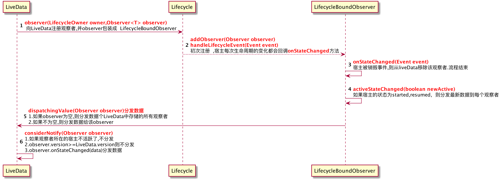

# LiveData的优势

**确保界面符合数据状态**

LiveData 遵循观察者模式。当生命周期状态发生变化时，LiveData 会通知 [Observer]对象并把最新数据派发给它。观察者可以在收到onChanged事件时更新界面，而不是在每次数据发生更改时立即更新界面。

**不再需要手动处理生命周期**

只需要观察相关数据，不用手动停止或恢复观察。LiveData 会自动管理Observer的反注册，因为它能感知宿主生命周期的变化，并在宿主生命周期的onDestory自动进行反注册。因此使用LiveData做消息分发不会发生内存泄漏

**数据始终保持最新状态**

如果宿主的生命周期变为非活跃状态，它会在再次变为活跃状态时接收最新的数据。例如，曾经在后台的 Activity 会在返回前台后立即接收最新的数据。

**支持黏性事件的分发**

即先发送一条数据，后注册一个观察者，默认是能够收到之前发送的那条数据的

**共享资源**

我们可以使用单例模式拓展 LiveData，实现全局的消息分发总线

#LiveData的几种用法

**使用 LiveDaata 之前需要先添加依赖：**

	 //通常情况下，只需要添加appcompat就可以了
	 api 'androidx.appcompat:appcompat:1.1.0'
	 //如果想单独使用，可引入下面两个依赖
	 api 'androidx.lifecycle:lifecycle-livedata:2.0.0'

**MutableLiveData**

我们在使用 LiveData 的做消息分发的时候，需要使用这个子类。之所以这么设计，是考虑到单一开闭原则，只有拿到 MutableLiveData 对象才可以发送消息，LiveData 对象只能接收消息，避免拿到 LiveData 对象时既能发消息也能收消息的混乱使用。

	   public class MutableLiveData<T> extends LiveData<T> {
	      @Override
	      public void postValue(T value) {
	        super.postValue(value);
	    }
	
	    @Override
	    public void setValue(T value) {
	        super.setValue(value);
	    }
	}

**MediatorLiveData**

可以统一观察多个 LiveData 发射的数据进行统一的处理。

同时也可以做为一个 LiveData，被其他 Observer 观察。

	  //创建两个长得差不多的LiveData对象
	LiveData<Integer> liveData1 =  new MutableLiveData();
	LiveData<Integer> liveData2 = new MutableLiveData();
	
	 //再创建一个聚合类MediatorLiveData
	 MediatorLiveData<Integer> liveDataMerger = new MediatorLiveData<>();
	 //分别把上面创建LiveData 添加进来。
	liveDataMerger.addSource(liveData1, observer);
	liveDataMerger.addSource(liveData2, observer);
	
	Observer observer = new Observer<Integer>() {
	  @Override
	 public void onChanged(@Nullable Integer s) {
	      titleTextView.setText(s);
	 }
	//一旦liveData或liveData发送了新的数据 ，observer便能观察的到，以便  统一处理更新UI

**Transformations.map 操作符**

可以对 Livedata 的数据进行变化，并且返回一个新的 Livedata 对象，这一点了解即可。

	
	//数据转换
	LiveData<String> transformData = Transformations.map(data, input ->   String.valueOf(input));
	//使用转换后生成的transformData去观察数据
	transformData.observe( this, output -> {
	
	});
	
	//使用原始的livedata发送数据
	data.setValue(10);
	

#LiveData 实现原理

