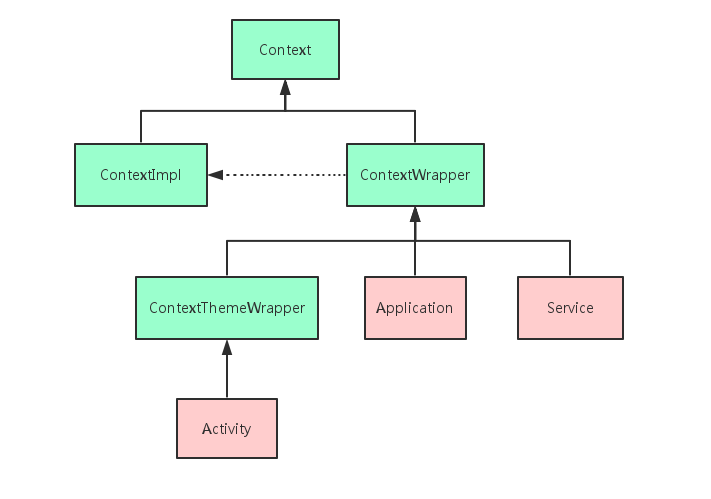
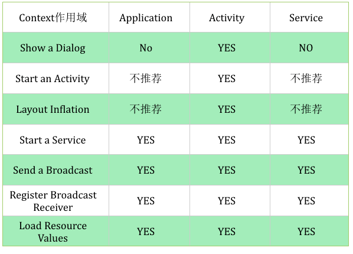
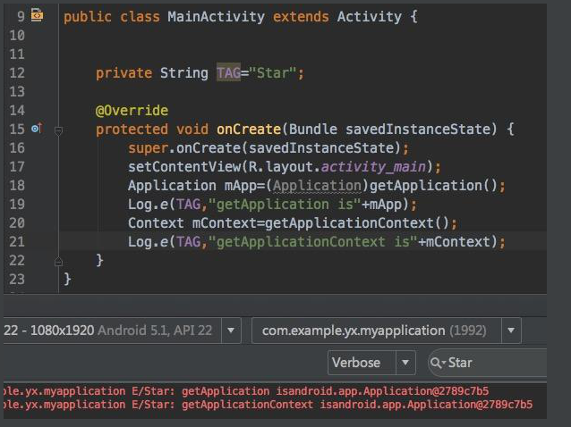

**Activity mActivity =new Activity()**

作为Android开发者，不知道你有没有思考过这个问题，Activity可以new吗？Android的应用程序开发采用JAVA语言，Activity本质上也是一个对象，那上面的写法有什么问题呢？估计很多人说不清道不明。Android程序不像Java程序一样，随便创建一个类，写个main()方法就能运行，**Android应用模型是基于组件的应用设计模式，组件的运行要有一个完整的Android工程环境**，在这个环境下，Activity、Service等系统组件才能够正常工作，而这些组件并不能采用普通的Java对象创建方式，new一下就能创建实例了，而是要有它们各自的上下文环境，也就是我们这里讨论的Context。可以这样讲，Context是维持Android程序中各组件能够正常工作的一个核心功能类。

## Context到底是什么?

  Context的中文翻译为：语境; 上下文; 背景; 环境，在开发中我们经常说称之为“上下文”，那么这个“上下文”到底是指什么意思呢？在语文中，我们可以理解为语境，在程序中，我们可以理解为当前对象在程序中所处的一个环境，一个与系统交互的过程。比如微信聊天，此时的“环境”是指聊天的界面以及相关的数据请求与传输，Context在加载资源、启动Activity、获取系统服务、创建View等操作都要参与。

那Context到底是什么呢？一个Activity就是一个Context，一个Service也是一个Context。Android程序员把“场景”抽象为Context类，他们认为用户和操作系统的每一次交互都是一个场景，比如打电话、发短信，这些都是一个有界面的场景，还有一些没有界面的场景，比如后台运行的服务（Service）。一个应用程序可以认为是一个工作环境，用户在这个环境中会切换到不同的场景，这就像一个前台秘书，她可能需要接待客人，可能要打印文件，还可能要接听客户电话，而这些就称之为不同的场景，前台秘书可以称之为一个应用程序。

## 如何生动形象的理解Context?

上面的概念中采用了通俗的理解方式，将Context理解为“上下文”或者“场景”，如果你仍然觉得很抽象，不好理解。在这里我给出一个可能不是很恰当的比喻，希望有助于大家的理解：一个Android应用程序，可以理解为一部电影或者一部电视剧，Activity，Service，Broadcast Receiver，Content Provider这四大组件就好比是这部戏里的四个主角：胡歌，霍建华，诗诗，Baby。他们是由剧组（系统）一开始就定好了的，整部戏就是由这四位主演领衔担纲的，所以这四位主角并不是大街上随随便便拉个人（new 一个对象）都能演的。有了演员当然也得有摄像机拍摄啊，他们必须通过镜头（Context）才能将戏传递给观众，这也就正对应说四大组件（四位主角）必须工作在Context环境下（摄像机镜头）。那Button，TextView，LinearLayout这些控件呢，就好比是这部戏里的配角或者说群众演员，他们显然没有这么重用，随便一个路人甲路人乙都能演（可以new一个对象），但是他们也必须要面对镜头（工作在Context环境下），所以`Button mButton=new Button（Context）`是可以的。虽然不很恰当，但还是很容易理解的，希望有帮助。

**源码中的Context**

```java
/**
 * Interface to global information about an application environment.  This is
 * an abstract class whose implementation is provided by
 * the Android system.  It
 * allows access to application-specific resources and classes, as well as
 * up-calls for application-level operations such as launching activities,
 * broadcasting and receiving intents, etc.
 */
public abstract class Context {
    /**
     * File creation mode: the default mode, where the created file can only
     * be accessed by the calling application (or all applications sharing the
     * same user ID).
     * @see #MODE_WORLD_READABLE
     * @see #MODE_WORLD_WRITEABLE
     */
    public static final int MODE_PRIVATE = 0x0000;

    public static final int MODE_WORLD_WRITEABLE = 0x0002;

    public static final int MODE_APPEND = 0x8000;

    public static final int MODE_MULTI_PROCESS = 0x0004;

    .
    .
    .
    }
```

源码中的注释是这么来解释Context的：Context提供了关于应用环境全局信息的接口。**它是一个抽象类，它的执行被Android系统所提供**。它允许获取以应用为特征的资源和类型，是一个统领一些资源（应用程序环境变量等）的上下文。就是说，它描述一个应用程序环境的信息（即上下文）；是一个抽象类，Android提供了该抽象类的具体实现类；通过它我们可以获取应用程序的资源和类（包括应用级别操作，如启动Activity，发广播，接受Intent等）。既然上面Context是一个抽象类，那么肯定有他的实现类咯，我们在Context的源码中通过IDE可以查看到他的子类最终可以得到如下关系图：



Context类本身是一个纯abstract类，它有两个具体的实现子类：ContextImpl和ContextWrapper。其中ContextWrapper类，如其名所言，这只是一个包装而已，ContextWrapper构造函数中必须包含一个真正的Context引用，同时ContextWrapper中提供了attachBaseContext（）用于给ContextWrapper对象中指定真正的Context对象，调用ContextWrapper的方法都会被转向其所包含的真正的Context对象。ContextThemeWrapper类，如其名所言，其内部包含了与主题（Theme）相关的接口，这里所说的主题就是指在AndroidManifest.xml中通过android：theme为Application元素或者Activity元素指定的主题。当然，只有Activity才需要主题，Service是不需要主题的，因为Service是没有界面的后台场景，所以Service直接继承于ContextWrapper，Application同理。而ContextImpl类则真正实现了Context中的所以函数，应用程序中所调用的各种Context类的方法，其实现均来自于该类。一句话总结：**Context的两个子类分工明确，其中ContextImpl是Context的具体实现类，ContextWrapper是Context的包装类。**Activity，Application，Service虽都继承自ContextWrapper（Activity继承自ContextWrapper的子类ContextThemeWrapper），但它们初始化的过程中都会创建ContextImpl对象，由ContextImpl实现Context中的方法。

## 一个应用程序有几个Context？

其实这个问题本身并没有什么意义，关键还是在于对Context的理解，从上面的关系图我们已经可以得出答案了，在应用程序中Context的具体实现子类就是：Activity，Service，Application。那么`Context数量=Activity数量+Service数量+1`。当然如果你足够细心，可能会有疑问：我们常说四大组件，这里怎么只有Activity，Service持有Context，那Broadcast Receiver，Content Provider呢？**Broadcast Receiver，Content Provider并不是Context的子类，他们所持有的Context都是其他地方传过去的，所以并不计入Context总数。**上面的关系图也从另外一个侧面告诉我们Context类在整个Android系统中的地位是多么的崇高，因为很显然Activity，Service，Application都是其子类，其地位和作用不言而喻。

## Context能干什么？

Context到底可以实现哪些功能呢？这个就实在是太多了，弹出Toast、启动Activity、启动Service、发送广播、操作数据库等等都需要用到Context。

```java
TextView tv = new TextView(getContext());

ListAdapter adapter = new SimpleCursorAdapter(getApplicationContext(), ...);

AudioManager am = (AudioManager) getContext().getSystemService(Context.AUDIO_SERVICE);getApplicationContext().getSharedPreferences(name, mode);

getApplicationContext().getContentResolver().query(uri, ...);

getContext().getResources().getDisplayMetrics().widthPixels * 5 / 8;

getContext().startActivity(intent);

getContext().startService(intent);

getContext().sendBroadcast(intent);
```

## Context作用域

虽然Context神通广大，但并不是随便拿到一个Context实例就可以为所欲为，它的使用还是有一些规则限制的。由于Context的具体实例是由ContextImpl类去实现的，因此在绝大多数场景下，Activity、Service和Application这三种类型的Context都是可以通用的。不过有几种场景比较特殊，比如启动Activity，还有弹出Dialog。出于安全原因的考虑，Android是不允许Activity或Dialog凭空出现的，一个Activity的启动必须要建立在另一个Activity的基础之上，也就是以此形成的返回栈。而Dialog则必须在一个Activity上面弹出（除非是System Alert类型的Dialog），因此在这种场景下，我们只能使用Activity类型的Context，否则将会出错。



从上图我们可以发现Activity所持有的Context的作用域最广，无所不能。因为Activity继承自ContextThemeWrapper，而Application和Service继承自ContextWrapper，很显然ContextThemeWrapper在ContextWrapper的基础上又做了一些操作使得Activity变得更强大，这里我就不再贴源码给大家分析了，有兴趣的童鞋可以自己查查源码。上图中的YES和NO我也不再做过多的解释了，这里我说一下上图中Application和Service所不推荐的两种使用情况。

1. 如果我们用ApplicationContext去启动一个LaunchMode为standard的Activity的时候会报错`android.util.AndroidRuntimeException: Calling startActivity from outside of an Activity context requires the FLAG_ACTIVITY_NEW_TASK flag. Is this really what you want?`

   这是因为非Activity类型的Context并没有所谓的任务栈，所以待启动的Activity就找不到栈了。解决这个问题的方法就是为待启动的Activity指定FLAG_ACTIVITY_NEW_TASK标记位，这样启动的时候就为它创建一个新的任务栈，而此时Activity是以singleTask模式启动的。所有这种用Application启动Activity的方式不推荐使用，Service同Application。

2. 在Application和Service中去layout inflate也是合法的，但是会使用系统默认的主题样式，如果你自定义了某些样式可能不会被使用。所以这种方式也不推荐使用。

一句话总结：凡是跟UI相关的，都应该使用Activity做为Context来处理；其他的一些操作，Service,Activity,Application等实例都可以，当然了，注意Context引用的持有，防止内存泄漏。

## 如何获取Context?

通常我们想要获取Context对象，主要有以下四种方法

1. View.getContext,返回当前View对象的Context对象，通常是当前正在展示的Activity对象。
2. Activity.getApplicationContext,获取当前Activity所在的(应用)进程的Context对象，通常我们使用Context对象时，要优先考虑这个全局的进程Context。
3. ContextWrapper.getBaseContext():用来获取一个ContextWrapper进行装饰之前的Context，可以使用这个方法，这个方法在实际开发中使用并不多，也不建议使用。
4. Activity.this 返回当前的Activity实例，如果是UI控件需要使用Activity作为Context对象，但是默认的Toast实际上使用ApplicationContext也可以。

**getApplication()和getApplicationContext()**

上面说到获取当前Application对象用getApplicationContext，不知道你有没有联想到getApplication()，这两个方法有什么区别？相信这个问题会难倒不少开发者。



程序是不会骗人的，我们通过上面的代码，打印得出两者的内存地址都是相同的，看来它们是同一个对象。其实这个结果也很好理解，因为前面已经说过了，Application本身就是一个Context，所以这里获取getApplicationContext()得到的结果就是Application本身的实例。那么问题来了，既然这两个方法得到的结果都是相同的，那么Android为什么要提供两个功能重复的方法呢？实际上这两个方法在作用域上有比较大的区别。getApplication()方法的语义性非常强，一看就知道是用来获取Application实例的，**但是这个方法只有在Activity和Service中才能调用的到**。那么也许在绝大多数情况下我们都是在Activity或者Service中使用Application的，但是如果在一些其它的场景，比如BroadcastReceiver中也想获得Application的实例，这时就可以借助getApplicationContext()方法了。

```java
public class MyReceiver extends BroadcastReceiver{
  @Override
  public void onReceive(Contextcontext,Intentintent){
    Application myApp= (Application)context.getApplicationContext();
  }
}
```

## Context引起的内存泄露

但Context并不能随便乱用，用的不好有可能会引起内存泄露的问题，下面就示例两种错误的引用方式。

**错误的单例模式**

```java
public class Singleton {
    private static Singleton instance;
    private Context mContext;

    private Singleton(Context context) {
        this.mContext = context;
    }

    public static Singleton getInstance(Context context) {
        if (instance == null) {
            instance = new Singleton(context);
        }
        return instance;
    }
}
```

这是一个非线程安全的单例模式，instance作为静态对象，其生命周期要长于普通的对象，其中也包含Activity，假如Activity A去getInstance获得instance对象，传入this，常驻内存的Singleton保存了你传入的Activity A对象，并一直持有，即使Activity被销毁掉，但因为它的引用还存在于一个Singleton中，就不可能被GC掉，这样就导致了内存泄漏。

**View持有Activity引用**

```java
public class MainActivity extends Activity {
    private static Drawable mDrawable;

    @Override
    protected void onCreate(Bundle saveInstanceState) {
        super.onCreate(saveInstanceState);
        setContentView(R.layout.activity_main);
        ImageView iv = new ImageView(this);
        mDrawable = getResources().getDrawable(R.drawable.ic_launcher);
        iv.setImageDrawable(mDrawable);
    }
}
```

有一个静态的Drawable对象，当ImageView设置这个Drawable时，ImageView保存了mDrawable的引用，而ImageView传入的this是MainActivity的mContext，因为被static修饰的mDrawable是常驻内存的，MainActivity是它的间接引用，MainActivity被销毁时，也不能被GC掉，所以造成内存泄漏。

**正确使用Context**

一般Context造成的内存泄漏，几乎都是当Context销毁的时候，却因为被引用导致销毁失败，而Application的Context对象可以理解为随着进程存在的，所以我们总结出使用Context的正确姿势：

1. 当Application的Context能搞定的情况下，并且生命周期长的对象，优先使用Application的Context。
2. 不要让生命周期长于Activity的对象持有到Activity的引用。
3. 尽量不要在Activity中使用非静态内部类，因为非静态内部类会隐式持有外部类实例的引用，如果使用静态内部类，将外部实例引用作为弱引用持有。
