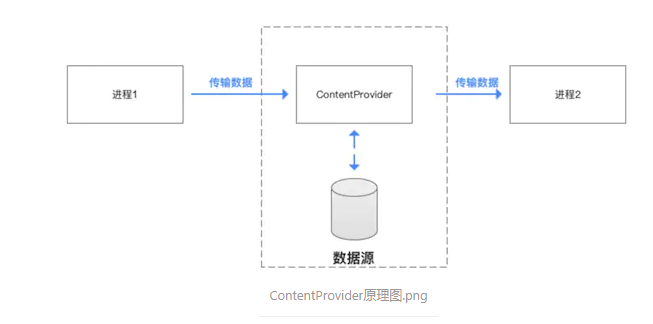
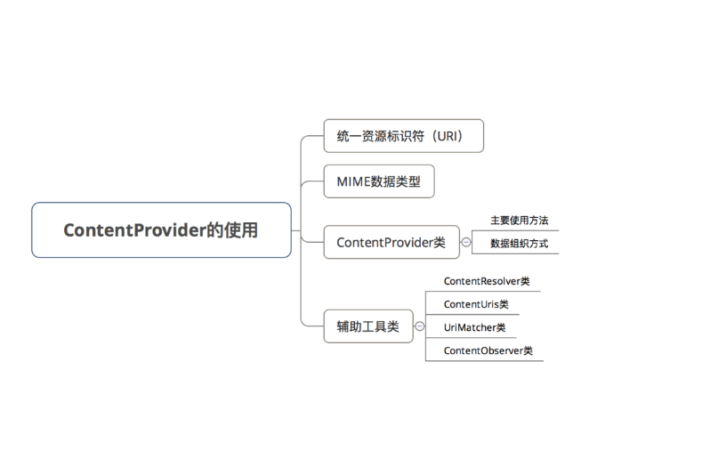
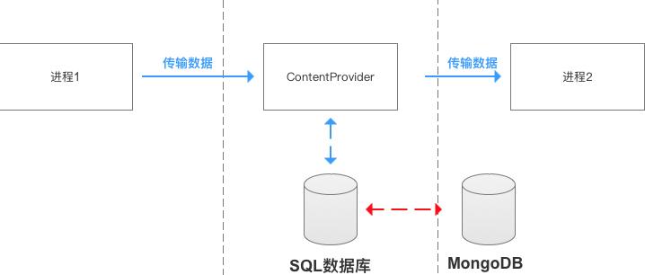
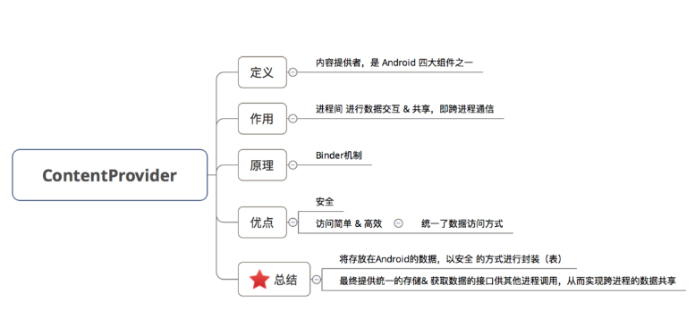

## 一、定义

ContentProvider，即内容提供者属于Android的四大组件之一。

## 二、 作用

进程间 进行**数据交互 & 共享**，即跨进程通信


## 三、 原理

`ContentProvider`的底层是采用 `Android`中的`Binder`机制

## 四、具体使用

关于`ContentProvider`的使用主要介绍以下内容：



### 4.1 统一资源标识符（URI）

- 定义：`Uniform Resource Identifier`，即统一资源标识符

- 作用：唯一标识 ContentProvider & 其中的数据

  > 外界进程通过 URI 找到对应的ContentProvider & 其中的数据，再进行数据操作

- 具体使用

  URI分为 系统预置 & 自定义，分别对应系统内置的数据（如通讯录、日程表等等）和自定义数据库

  > 1. 关于 系统预置`URI` 此处不作过多讲解，需要的同学可自行查看
  > 2. 此处主要讲解 自定义`URI`


```Java
// 设置URI
Uri uri = Uri.parse("content://com.carson.provider/User/1") 
// 上述URI指向的资源是：名为 `com.carson.provider`的`ContentProvider` 中表名 为`User` 中的 `id`为1的数据

// 特别注意：URI模式存在匹配通配符* & ＃

// *：匹配任意长度的任何有效字符的字符串
// 以下的URI 表示 匹配provider的任何内容
content://com.example.app.provider/* 
// ＃：匹配任意长度的数字字符的字符串
// 以下的URI 表示 匹配provider中的table表的所有行
content://com.example.app.provider/table/#
```

### 4.2  MIME数据类型

- 解释：MIME：全称Multipurpose Internet Mail Extensions，多功能Internet 邮件扩充服务。它是一种多用途网际邮件扩充协议，在1992年最早应用于电子邮件系统，但后来也应用到浏览器。MIME类型就是设定某种扩展名的文件用一种应用程序来打开的方式类型，当该扩展名文件被访问的时候，浏览器会自动使用指定应用程序来打开。多用于指定一些客户端自定义的文件名，以及一些媒体文件打开方式。
- 作用：指定某个扩展名的文件用某种应用程序来打开
  如指定`.html`文件采用`text`应用程序打开、指定`.pdf`文件采用`flash`应用程序打开
- 具体使用：

**4.2.1 ContentProvider根据 URI 返回MIME类型**

```java
ContentProvider.geType(uri) ；
```

**4.2.2 MIME类型组成**
每种`MIME`类型 由2部分组成 = 类型 + 子类型

> MIME类型是 一个 包含2部分的字符串

```java
text / html
// 类型 = text、子类型 = html

text/css
text/xml
application/pdf
```

**4.2.3 MIME类型形式**
`MIME`类型有2种形式：

```java
// 形式1：单条记录  
vnd.android.cursor.item/自定义
// 形式2：多条记录（集合）
vnd.android.cursor.dir/自定义 

// 注：
  // 1. vnd：表示父类型和子类型具有非标准的、特定的形式。
  // 2. 父类型已固定好（即不能更改），只能区别是单条还是多条记录
  // 3. 子类型可自定义
```

#### 实例说明

```java
<-- 单条记录 -->
  // 单个记录的MIME类型
  vnd.android.cursor.item/vnd.yourcompanyname.contenttype 

  // 若一个Uri如下
  content://com.example.transportationprovider/trains/122   
  // 则ContentProvider会通过ContentProvider.geType(url)返回以下MIME类型
  vnd.android.cursor.item/vnd.example.rail


<-- 多条记录 -->
  // 多个记录的MIME类型
  vnd.android.cursor.dir/vnd.yourcompanyname.contenttype 
  // 若一个Uri如下
  content://com.example.transportationprovider/trains 
  // 则ContentProvider会通过ContentProvider.geType(url)返回以下MIME类型
  vnd.android.cursor.dir/vnd.example.rail
```

### 4.3 ContentProvider类

**4.3.1 组织数据方式**

- ContentProvider主要以表格的形式组织数据

  > 同时也支持文件数据，只是表格形式用得比较多

- 每个表格中包含多张表，每张表包含行 & 列，分别对应记录 & 字段

  > 同数据库

**4.3.2 主要方法**

- **进程**间共享数据的本质是：添加、删除、获取 & 修改（更新）数据
- 所以`ContentProvider`的核心方法也主要是上述4个作用

```java
<-- 4个核心方法 -->
  public Uri insert(Uri uri, ContentValues values) 
  // 外部进程向 ContentProvider 中添加数据

  public int delete(Uri uri, String selection, String[] selectionArgs) 
  // 外部进程 删除 ContentProvider 中的数据

  public int update(Uri uri, ContentValues values, String selection, String[] selectionArgs)
  // 外部进程更新 ContentProvider 中的数据

  public Cursor query(Uri uri, String[] projection, String selection, String[] selectionArgs,  String sortOrder)　 
  // 外部应用 获取 ContentProvider 中的数据

// 注：
  // 1. 上述4个方法由外部进程回调，并运行在ContentProvider进程的Binder线程池中（不是主线程）
 // 2. 存在多线程并发访问，需要实现线程同步
   // a. 若ContentProvider的数据存储方式是使用SQLite & 一个，则不需要，因为SQLite内部实现好了线程同步，若是多个SQLite则需要，因为SQL对象之间无法进行线程同步
  // b. 若ContentProvider的数据存储方式是内存，则需要自己实现线程同步

<-- 2个其他方法 -->
public boolean onCreate() 
// ContentProvider创建后 或 打开系统后其它进程第一次访问该ContentProvider时 由系统进行调用
// 注：运行在ContentProvider进程的主线程，故不能做耗时操作

public String getType(Uri uri)
// 得到数据类型，即返回当前 Url 所代表数据的MIME类型
```

- `Android`为常见的数据（如通讯录、日程表等）提供了内置了默认的`ContentProvider`

- 但也可根据需求自定义ContentProvider，但上述6个方法必须重写

  > 本文主要讲解自定义`ContentProvider`

- `ContentProvider`类并不会直接与外部进程交互，而是通过`ContentResolver` 类

### 4.4 ContentResolver类

**4.41 作用**

统一管理不同 `ContentProvider`间的操作

> 1. 通过 `URI` 即可操作 不同的`ContentProvider` 中的数据
> 2. 外部进程通过 `ContentResolver`类 从而与`ContentProvider`类进行交互

**4.2 为什么要使用通过`ContentResolver`类从而与`ContentProvider`类进行交互，而不直接访问`ContentProvider`类？**

- 一般来说，一款应用要使用多个`ContentProvider`，若需要了解每个`ContentProvider`的不同实现从而再完成数据交互，**操作成本高  & 难度大**
- 所以再`ContentProvider`类上加多了一个 `ContentResolver`类对所有的`ContentProvider`进行统一管理。

**4.3 具体使用**

`ContentResolver` 类提供了与`ContentProvider`类相同名字 & 作用的4个方法

```java
// 外部进程向 ContentProvider 中添加数据
public Uri insert(Uri uri, ContentValues values)　 

// 外部进程 删除 ContentProvider 中的数据
public int delete(Uri uri, String selection, String[] selectionArgs)

// 外部进程更新 ContentProvider 中的数据
public int update(Uri uri, ContentValues values, String selection, String[] selectionArgs)　 

// 外部应用 获取 ContentProvider 中的数据
public Cursor query(Uri uri, String[] projection, String selection, String[] selectionArgs, String sortOrder)
```

- 实例说明

```java
// 使用ContentResolver前，需要先获取ContentResolver
// 可通过在所有继承Context的类中 通过调用getContentResolver()来获得ContentResolver
ContentResolver resolver =  getContentResolver(); 

// 设置ContentProvider的URI
Uri uri = Uri.parse("content://cn.scu.myprovider/user"); 

// 根据URI 操作 ContentProvider中的数据
// 此处是获取ContentProvider中 user表的所有记录 
Cursor cursor = resolver.query(uri, null, null, null, "userid desc");
```

`Android` 提供了3个用于辅助`ContentProvide`的工具类：

- `ContentUris`
- `UriMatcher`
- `ContentObserver`

### 4.5 ContentUris类

- 作用：操作 `URI`
- 具体使用
  核心方法有两个：`withAppendedId（）` &`parseId（）`

```java
// withAppendedId（）作用：向URI追加一个id
Uri uri = Uri.parse("content://cn.scu.myprovider/user") 
Uri resultUri = ContentUris.withAppendedId(uri, 7);  
// 最终生成后的Uri为：content://cn.scu.myprovider/user/7

// parseId（）作用：从URL中获取ID
Uri uri = Uri.parse("content://cn.scu.myprovider/user/7") 
long personid = ContentUris.parseId(uri); 
//获取的结果为:7
```

### 4.6 UriMatcher类

- 作用
  1. 在`ContentProvider` 中注册`URI`
  2. 根据 `URI` 匹配 `ContentProvider` 中对应的数据表
- 具体使用

```Java
// 步骤1：初始化UriMatcher对象
UriMatcher matcher = new UriMatcher(UriMatcher.NO_MATCH);
//常量UriMatcher.NO_MATCH  = 不匹配任何路径的返回码
// 即初始化时不匹配任何东西

// 步骤2：在ContentProvider 中注册URI（addURI（））
int URI_CODE_a = 1；
int URI_CODE_b = 2；
matcher.addURI("cn.scu.myprovider", "user1", URI_CODE_a);
matcher.addURI("cn.scu.myprovider", "user2", URI_CODE_b);
// 若URI资源路径 = content://cn.scu.myprovider/user1 ，则返回注册码URI_CODE_a
// 若URI资源路径 = content://cn.scu.myprovider/user2 ，则返回注册码URI_CODE_b

// 步骤3：根据URI 匹配 URI_CODE，从而匹配ContentProvider中相应的资源（match（））

@Override
public String getType (Uri uri){
    Uri uri = Uri.parse(" content://cn.scu.myprovider/user1");

    switch (matcher.match(uri)) {
        // 根据URI匹配的返回码是URI_CODE_a
        // 即matcher.match(uri) == URI_CODE_a
        case URI_CODE_a:
            return tableNameUser1;
        // 如果根据URI匹配的返回码是URI_CODE_a，则返回ContentProvider中的名为tableNameUser1的表
        case URI_CODE_b:
            return tableNameUser2;
        // 如果根据URI匹配的返回码是URI_CODE_b，则返回ContentProvider中的名为tableNameUser2的表
    }
}
```

### 4.7 ContentObserver类

- 定义：内容观察者

- 作用：观察 Uri引起ContentProvider 中的数据变化 & 通知外界（即访问该数据访问者）

  > 当`ContentProvider` 中的数据发生变化（增、删 & 改）时，就会触发该 `ContentObserver`类

- 具体使用

```Java
// 步骤1：注册内容观察者ContentObserver
getContentResolver().registerContentObserver（uri）；
// 通过ContentResolver类进行注册，并指定需要观察的URI

// 步骤2：当该URI的ContentProvider数据发生变化时，通知外界（即访问该ContentProvider数据的访问者）
public class UserContentProvider extends ContentProvider {
    public Uri insert(Uri uri, ContentValues values) {
        db.insert("user", "userid", values);
        getContext().getContentResolver().notifyChange(uri, null);
        // 通知访问者
    }
}

// 步骤3：解除观察者
getContentResolver().unregisterContentObserver（uri）；
// 同样需要通过ContentResolver类进行解除
```

至此，关于`ContentProvider`的使用已经讲解完毕

## 五、 实例说明

- 由于`ContentProvider`不仅常用于进程间通信，同时也适用于进程内通信

- 所以本实例会采用ContentProvider讲解：

  1. 进程内通信
  2. 进程间通信

- 实例说明：采用的数据源是`Android`中的`SQLite`数据库

### 5.1 进程内通信

- 步骤说明：
  1. 创建数据库类
  2. 自定义 `ContentProvider` 类
  3. 注册 创建的 `ContentProvider`类
  4. 进程内访问 `ContentProvider`的数据
- 具体使用

**步骤1：创建数据库类**
**DBHelper.java**

```java
public class DBHelper extends SQLiteOpenHelper {

    // 数据库名
    private static final String DATABASE_NAME = "finch.db";

    // 表名
    public static final String USER_TABLE_NAME = "user";
    public static final String JOB_TABLE_NAME = "job";

    private static final int DATABASE_VERSION = 1;
    //数据库版本号

    public DBHelper(Context context) {
        super(context, DATABASE_NAME, null, DATABASE_VERSION);
    }

    @Override
    public void onCreate(SQLiteDatabase db) {

        // 创建两个表格:用户表 和职业表
        db.execSQL("CREATE TABLE IF NOT EXISTS " + USER_TABLE_NAME + "(_id INTEGER PRIMARY KEY AUTOINCREMENT," + " name TEXT)");
        db.execSQL("CREATE TABLE IF NOT EXISTS " + JOB_TABLE_NAME + "(_id INTEGER PRIMARY KEY AUTOINCREMENT," + " job TEXT)");
    }

    @Override
    public void onUpgrade(SQLiteDatabase db, int oldVersion, int newVersion)   {

    }
}
```

**步骤2：自定义 ContentProvider 类**

```java
public class MyProvider extends ContentProvider {

    private Context mContext;
    DBHelper mDbHelper = null;
    SQLiteDatabase db = null;

    public static final String AUTOHORITY = "cn.scu.myprovider";
    // 设置ContentProvider的唯一标识

    public static final int User_Code = 1;
    public static final int Job_Code = 2;

    // UriMatcher类使用:在ContentProvider 中注册URI
    private static final UriMatcher mMatcher;

    static {
        mMatcher = new UriMatcher(UriMatcher.NO_MATCH);
        // 初始化
        mMatcher.addURI(AUTOHORITY, "user", User_Code);
        mMatcher.addURI(AUTOHORITY, "job", Job_Code);
        // 若URI资源路径 = content://cn.scu.myprovider/user ，则返回注册码User_Code
        // 若URI资源路径 = content://cn.scu.myprovider/job ，则返回注册码Job_Code
    }

    // 以下是ContentProvider的6个方法

    /**
     * 初始化ContentProvider
     */
    @Override
    public boolean onCreate() {

        mContext = getContext();
        // 在ContentProvider创建时对数据库进行初始化
        // 运行在主线程，故不能做耗时操作,此处仅作展示
        mDbHelper = new DBHelper(getContext());
        db = mDbHelper.getWritableDatabase();

        // 初始化两个表的数据(先清空两个表,再各加入一个记录)
        db.execSQL("delete from user");
        db.execSQL("insert into user values(1,'Carson');");
        db.execSQL("insert into user values(2,'Kobe');");

        db.execSQL("delete from job");
        db.execSQL("insert into job values(1,'Android');");
        db.execSQL("insert into job values(2,'iOS');");

        return true;
    }

    /**
     * 添加数据
     */
    @Override
    public Uri insert(Uri uri, ContentValues values) {

        // 根据URI匹配 URI_CODE，从而匹配ContentProvider中相应的表名
        // 该方法在最下面
        String table = getTableName(uri);

        // 向该表添加数据
        db.insert(table, null, values);

        // 当该URI的ContentProvider数据发生变化时，通知外界（即访问该ContentProvider数据的访问者）
        mContext.getContentResolver().notifyChange(uri, null);

//        // 通过ContentUris类从URL中获取ID
//        long personid = ContentUris.parseId(uri);
//        System.out.println(personid);

        return uri;
    }

    /**
     * 查询数据
     */
    @Override
    public Cursor query(Uri uri, String[] projection, String selection,
                        String[] selectionArgs, String sortOrder) {
        // 根据URI匹配 URI_CODE，从而匹配ContentProvider中相应的表名
        // 该方法在最下面
        String table = getTableName(uri);

//        // 通过ContentUris类从URL中获取ID
//        long personid = ContentUris.parseId(uri);
//        System.out.println(personid);

        // 查询数据
        return db.query(table, projection, selection, selectionArgs, null, null, sortOrder, null);
    }

    /**
     * 更新数据
     */
    @Override
    public int update(Uri uri, ContentValues values, String selection,
                      String[] selectionArgs) {
        // 由于不展示,此处不作展开
        return 0;
    }

    /**
     * 删除数据
     */
    @Override
    public int delete(Uri uri, String selection, String[] selectionArgs) {
        // 由于不展示,此处不作展开
        return 0;
    }

    @Override
    public String getType(Uri uri) {

        // 由于不展示,此处不作展开
        return null;
    }

    /**
     * 根据URI匹配 URI_CODE，从而匹配ContentProvider中相应的表名
     */
    private String getTableName(Uri uri) {
        String tableName = null;
        switch (mMatcher.match(uri)) {
            case User_Code:
                tableName = DBHelper.USER_TABLE_NAME;
                break;
            case Job_Code:
                tableName = DBHelper.JOB_TABLE_NAME;
                break;
        }
        return tableName;
    }
}
```

**步骤3：注册 创建的 ContentProvider类**
**AndroidManifest.xml**

``` xml
<provider android:name="MyProvider"
  android:authorities="cn.scu.myprovider"/>
```

**步骤4：进程内访问 ContentProvider中的数据**

**MainActivity.java**

```java
public class MainActivity extends AppCompatActivity {

    @Override
    protected void onCreate(Bundle savedInstanceState) {
        super.onCreate(savedInstanceState);
        setContentView(R.layout.activity_main);

        /**
         * 对user表进行操作
         */

        // 设置URI
        Uri uri_user = Uri.parse("content://cn.scu.myprovider/user");

        // 插入表中数据
        ContentValues values = new ContentValues();
        values.put("_id", 3);
        values.put("name", "Iverson");


        // 获取ContentResolver
        ContentResolver resolver =  getContentResolver();
        // 通过ContentResolver 根据URI 向ContentProvider中插入数据
        resolver.insert(uri_user,values);

        // 通过ContentResolver 向ContentProvider中查询数据
        Cursor cursor = resolver.query(uri_user, new String[]{"_id","name"}, null, null, null);
        while (cursor.moveToNext()){
            System.out.println("query book:" + cursor.getInt(0) +" "+ cursor.getString(1));
            // 将表中数据全部输出
        }
        cursor.close();
        // 关闭游标

        /**
         * 对job表进行操作
         */
        // 和上述类似,只是URI需要更改,从而匹配不同的URI CODE,从而找到不同的数据资源
        Uri uri_job = Uri.parse("content://cn.scu.myprovider/job");

        // 插入表中数据
        ContentValues values2 = new ContentValues();
        values2.put("_id", 3);
        values2.put("job", "NBA Player");

        // 获取ContentResolver
        ContentResolver resolver2 =  getContentResolver();
        // 通过ContentResolver 根据URI 向ContentProvider中插入数据
        resolver2.insert(uri_job,values2);

        // 通过ContentResolver 向ContentProvider中查询数据
        Cursor cursor2 = resolver2.query(uri_job, new String[]{"_id","job"}, null, null, null);
        while (cursor2.moveToNext()){
            System.out.println("query job:" + cursor2.getInt(0) +" "+ cursor2.getString(1));
            // 将表中数据全部输出
        }
        cursor2.close();
        // 关闭游标
}
}
```

### 结果


### 5.2 进程间进行数据共享

- 实例说明：本文需要创建2个进程，即创建两个工程，作用如下


#### 进程1

使用步骤如下：

1. 创建数据库类
2. 自定义 `ContentProvider` 类
3. 注册 创建的 `ContentProvider` 类

前2个步骤同上例相同，此处不作过多描述，此处主要讲解步骤3.

**步骤3：注册 创建的 ContentProvider类**
*AndroidManifest.xml*

```xml
<provider 
               android:name="MyProvider"
               android:authorities="scut.carson_ho.myprovider"

               // 声明外界进程可访问该Provider的权限（读 & 写）
               android:permission="scut.carson_ho.PROVIDER"             

               // 权限可细分为读 & 写的权限
               // 外界需要声明同样的读 & 写的权限才可进行相应操作，否则会报错
               // android:readPermisson = "scut.carson_ho.Read"
               // android:writePermisson = "scut.carson_ho.Write"

               // 设置此provider是否可以被其他进程使用
               android:exported="true"

  />

// 声明本应用 可允许通信的权限
    <permission android:name="scut.carson_ho.Read" android:protectionLevel="normal"/>
    // 细分读 & 写权限如下，但本Demo直接采用全权限
    // <permission android:name="scut.carson_ho.Write" android:protectionLevel="normal"/>
    // <permission android:name="scut.carson_ho.PROVIDER" android:protectionLevel="normal"/>
```

至此，进程1创建完毕，即创建`ContentProvider` & 数据 准备好了。

#### 进程2

**步骤1：声明可访问的权限**

**AndroidManifest.xml**

```Xml
    // 声明本应用可允许通信的权限（全权限）
    <uses-permission android:name="scut.carson_ho.PROVIDER"/>

    // 细分读 & 写权限如下，但本Demo直接采用全权限
    // <uses-permission android:name="scut.carson_ho.Read"/>
    //  <uses-permission android:name="scut.carson_ho.Write"/>

// 注：声明的权限必须与进程1中设置的权限对应
```

**步骤2：访问 ContentProvider的类**

```java
public class MainActivity extends AppCompatActivity {

    @Override
    protected void onCreate(Bundle savedInstanceState) {
        super.onCreate(savedInstanceState);
        setContentView(R.layout.activity_main);

        /**
         * 对user表进行操作
         */

        // 设置URI
        Uri uri_user = Uri.parse("content://scut.carson_ho.myprovider/user");

        // 插入表中数据
        ContentValues values = new ContentValues();
        values.put("_id", 4);
        values.put("name", "Jordan");


        // 获取ContentResolver
        ContentResolver resolver =  getContentResolver();
        // 通过ContentResolver 根据URI 向ContentProvider中插入数据
        resolver.insert(uri_user,values);

        // 通过ContentResolver 向ContentProvider中查询数据
        Cursor cursor = resolver.query(uri_user, new String[]{"_id","name"}, null, null, null);
        while (cursor.moveToNext()){
            System.out.println("query book:" + cursor.getInt(0) +" "+ cursor.getString(1));
            // 将表中数据全部输出
        }
        cursor.close();
        // 关闭游标

        /**
         * 对job表进行操作
         */
        // 和上述类似,只是URI需要更改,从而匹配不同的URI CODE,从而找到不同的数据资源
        Uri uri_job = Uri.parse("content://scut.carson_ho.myprovider/job");

        // 插入表中数据
        ContentValues values2 = new ContentValues();
        values2.put("_id", 4);
        values2.put("job", "NBA Player");

        // 获取ContentResolver
        ContentResolver resolver2 =  getContentResolver();
        // 通过ContentResolver 根据URI 向ContentProvider中插入数据
        resolver2.insert(uri_job,values2);

        // 通过ContentResolver 向ContentProvider中查询数据
        Cursor cursor2 = resolver2.query(uri_job, new String[]{"_id","job"}, null, null, null);
        while (cursor2.moveToNext()){
            System.out.println("query job:" + cursor2.getInt(0) +" "+ cursor2.getString(1));
            // 将表中数据全部输出
        }
        cursor2.close();
        // 关闭游标
    }
}
```

#### 结果展示

**在进程展示时，需要先运行准备数据的进程1，再运行需要访问数据的进程2**

1. 运行准备数据的进程1
   在进程1中，我们准备好了一系列数据


2. 运行需要访问数据的进程2
   在进程2中，我们先向`ContentProvider`中插入数据，再查询数据


## 六、优点

### 6.1 安全

`ContentProvider`为应用间的数据交互提供了一个安全的环境：允许把自己的应用数据根据需求开放给 其他应用 进行 **增、删、改、查**，而不用担心因为直接开放数据库权限而带来的安全问题

### 6.2 访问简单 & 高效

对比于其他对外共享数据的方式，数据访问方式会因数据存储的方式而不同：

- 采用 文件方式 对外共享数据，需要进行文件操作读写数据； 
- 采用 `Sharedpreferences` 共享数据，需要使用sharedpreferences API读写数据

这使得访问数据变得复杂 & 难度大。

- 而采用ContentProvider方式，其解耦了底层数据的存储方式，使得无论底层数据存储采用何种方式，外界对数据的访问方式都是统一的，这使得访问简单 & 高效

  > 如一开始数据存储方式 采用 `SQLite` 数据库，后来把数据库换成 `MongoDB`，也不会对上层数据`ContentProvider`使用代码产生影响


## 七、 总结

- 我用一张图总结本文内容


