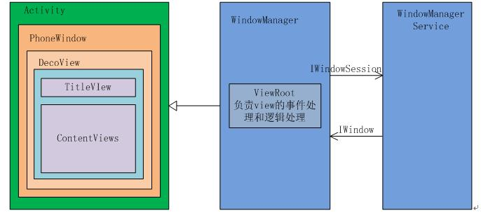
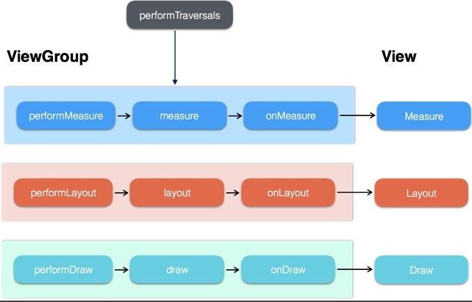

## 一、职能简介

### Activity

Activity并不负责视图控制，它只是控制生命周期和处理事件。真正控制视图的是Window。一个Activity包含了一个Window，Window才是真正代表一个窗口。**Activity就像一个控制器，统筹视图的添加与显示，以及通过其他回调方法，来与Window、以及View进行交互。**

### Window

Window是视图的承载器，内部持有一个 DecorView，而这个DecorView才是 view 的根布局。Window是一个抽象类，实际在Activity中持有的是其子类PhoneWindow。PhoneWindow中有个内部类DecorView，通过创建DecorView来加载Activity中设置的布局`R.layout.activity_main`。Window 通过WindowManager将DecorView加载其中，并将DecorView交给ViewRoot，进行视图绘制以及其他交互。

### DecorView

DecorView是FrameLayout的子类，它可以被认为是Android视图树的根节点视图。DecorView作为顶级View，一般情况下它内部包含一个竖直方向的LinearLayout，**在这个LinearLayout里面有上下三个部分，上面是个ViewStub，延迟加载的视图（应该是设置ActionBar，根据Theme设置），中间的是标题栏(根据Theme设置，有的布局没有)，下面的是内容栏。** 具体情况和Android版本及主体有关，以其中一个布局为例，如下所示：

```xml
<LinearLayout xmlns:android="http://schemas.android.com/apk/res/android"
    android:fitsSystemWindows="true"
    android:orientation="vertical">
    <!-- Popout bar for action modes -->
    <ViewStub
        android:id="@+id/action_mode_bar_stub"
        android:layout_width="match_parent"
        android:layout_height="wrap_content"
        android:inflatedId="@+id/action_mode_bar"
        android:layout="@layout/action_mode_bar"
        android:theme="?attr/actionBarTheme" />

    <FrameLayout
        style="?android:attr/windowTitleBackgroundStyle"
        android:layout_width="match_parent"
        android:layout_height="?android:attr/windowTitleSize">

        <TextView
            android:id="@android:id/title"
            style="?android:attr/windowTitleStyle"
            android:layout_width="match_parent"
            android:layout_height="match_parent"
            android:background="@null"
            android:fadingEdge="horizontal"
            android:gravity="center_vertical" />
    </FrameLayout>

    <FrameLayout
        android:id="@android:id/content"
        android:layout_width="match_parent"
        android:layout_height="0dip"
        android:layout_weight="1"
        android:foreground="?android:attr/windowContentOverlay"
        android:foregroundGravity="fill_horizontal|top" />
</LinearLayout>
```

在Activity中通过setContentView所设置的布局文件其实就是被加到内容栏之中的，成为其唯一子View，就是上面的id为content的FrameLayout中，在代码中可以通过content来得到对应加载的布局。

```java
ViewGroup content = (ViewGroup)findViewById(android.R.id.content);
ViewGroup rootView = (ViewGroup) content.getChildAt(0);
```

### ViewRoot

ViewRoot可能比较陌生，但是其作用非常重大。所有View的绘制以及事件分发等交互都是通过它来执行或传递的。

ViewRoot对应**ViewRootImpl类，它是连接WindowManagerService和DecorView的纽带**，View的三大流程（测量（measure），布局（layout），绘制（draw））均通过ViewRoot来完成。

ViewRoot并不属于View树的一份子。从源码实现上来看，它既非View的子类，也非View的父类，但是，它实现了ViewParent接口，这让它可以作为View的**名义上的父视图**。RootView继承了Handler类，可以接收事件并分发，Android的所有触屏事件、按键事件、界面刷新等事件都是通过ViewRoot进行分发的。

下面结构图可以清晰的揭示四者之间的关系：



## 二、DecorView的创建

这部分内容主要讲DecorView是怎么一层层嵌套在Actvity，PhoneWindow中的，以及DecorView如何加载内部布局。

### setContentView

先是从Activity中的setContentView()开始。

```java
public void setContentView(@LayoutRes int layoutResID) {
	getWindow().setContentView(layoutResID);
	initWindowDecorActionBar();
}
```

可以看到实际是交给Window装载视图。**下面来看看Activity是怎么获得Window对象的？**

```java
final void attach(Context context, ActivityThread aThread,
	Instrumentation instr, IBinder token, int ident,
	Application application, Intent intent, ActivityInfo info,
	CharSequence title, Activity parent, String id,
	NonConfigurationInstances lastNonConfigurationInstances,
	Configuration config, String referrer, IVoiceInteractor voiceInteractor,
	Window window) {
		..................................................................
        mWindow = new PhoneWindow(this, window);//创建一个Window对象
        mWindow.setWindowControllerCallback(this);
        mWindow.setCallback(this);//设置回调，向Activity分发点击或状态改变等事件
        mWindow.setOnWindowDismissedCallback(this);
        .................................................................
        mWindow.setWindowManager(
        	(WindowManager)context.getSystemService(Context.WINDOW_SERVICE),
        	mToken, mComponent.flattenToString(),
                (info.flags & ActivityInfo.FLAG_HARDWARE_ACCELERATED) != 0);//给Window设置WindowManager对象
        ....................................................................
}
```

在Activity中的attach()方法中，生成了PhoneWindow实例。既然有了Window对象，那么我们就可以**设置DecorView给Window对象了。**

```java
public void setContentView(int layoutResID) {
    if (mContentParent == null) {//mContentParent为空，创建一个DecroView
    	installDecor();
    } else {
        mContentParent.removeAllViews();//mContentParent不为空，删除其中的View
    }
    mLayoutInflater.inflate(layoutResID, mContentParent);//为mContentParent添加子View,即Activity中设置的布局文件
    final Callback cb = getCallback();
    if (cb != null && !isDestroyed()) {
        cb.onContentChanged();//回调通知，内容改变
    }
}
```

看了下来，可能有一个疑惑：**mContentParent到底是什么？** 就是前面布局中`@android:id/content`所对应的FrameLayout。

**通过上面的流程我们大致可以了解先在PhoneWindow中创建了一个DecroView，其中创建的过程中可能根据Theme不同，加载不同的布局格式，例如有没有Title，或有没有ActionBar等，然后再向mContentParent中加入子View，即Activity中设置的布局。到此位置，视图一层层嵌套添加上了。**

下面具体来看看`installDecor();`方法，**怎么创建的DecroView，并设置其整体布局？**

```java
private void installDecor() {
    if (mDecor == null) {
        mDecor = generateDecor(); //生成DecorView
        mDecor.setDescendantFocusability(ViewGroup.FOCUS_AFTER_DESCENDANTS);
        mDecor.setIsRootNamespace(true);
        if (!mInvalidatePanelMenuPosted && mInvalidatePanelMenuFeatures != 0) {
            mDecor.postOnAnimation(mInvalidatePanelMenuRunnable);
        }
    }
    if (mContentParent == null) {
        mContentParent = generateLayout(mDecor); // 为DecorView设置布局格式，并返回mContentParent
        ...
        } 
    }
}
```

再来看看 generateDecor()

```java
protected DecorView generateDecor() {
    return new DecorView(getContext(), -1);
}
```

很简单，创建了一个DecorView。

再看generateLayout

```java
protected ViewGroup generateLayout(DecorView decor) {
    // 从主题文件中获取样式信息
    TypedArray a = getWindowStyle();

    ...................

    if (a.getBoolean(R.styleable.Window_windowNoTitle, false)) {
        requestFeature(FEATURE_NO_TITLE);
    } else if (a.getBoolean(R.styleable.Window_windowActionBar, false)) {
        // Don't allow an action bar if there is no title.
        requestFeature(FEATURE_ACTION_BAR);
    }

    ................

    // 根据主题样式，加载窗口布局
    int layoutResource;
    int features = getLocalFeatures();
    // System.out.println("Features: 0x" + Integer.toHexString(features));
    if ((features & (1 << FEATURE_SWIPE_TO_DISMISS)) != 0) {
        layoutResource = R.layout.screen_swipe_dismiss;
    } else if(...){
        ...
    }

    View in = mLayoutInflater.inflate(layoutResource, null);//加载layoutResource

    //往DecorView中添加子View，即文章开头介绍DecorView时提到的布局格式，那只是一个例子，根据主题样式不同，加载不同的布局。
    decor.addView(in, new ViewGroup.LayoutParams(MATCH_PARENT, MATCH_PARENT)); 
    mContentRoot = (ViewGroup) in;

    ViewGroup contentParent = (ViewGroup)findViewById(ID_ANDROID_CONTENT);// 这里获取的就是mContentParent
    if (contentParent == null) {
        throw new RuntimeException("Window couldn't find content container view");
    }

    if ((features & (1 << FEATURE_INDETERMINATE_PROGRESS)) != 0) {
        ProgressBar progress = getCircularProgressBar(false);
        if (progress != null) {
            progress.setIndeterminate(true);
        }
    }

    if ((features & (1 << FEATURE_SWIPE_TO_DISMISS)) != 0) {
        registerSwipeCallbacks();
    }

    // Remaining setup -- of background and title -- that only applies
    // to top-level windows.
    ...

    return contentParent;
}
```

虽然比较复杂，但是逻辑还是很清楚的。先从主题中获取样式，然后根据样式，加载对应的布局到DecorView中，然后从中获取mContentParent。获得到之后，可以回到上面的代码，为mContentParent添加View，即Activity中的布局。

以上就是DecorView的创建过程，其实到`installDecor()`就已经介绍完了，后面只是具体介绍其中的逻辑。

## 三、DecorView的显示

以上仅仅是将DecorView建立起来。通过setContentView()设置的界面，为什么在onResume()之后才对用户可见呢？

这就要从ActivityThread开始说起。

```Java
private void handleLaunchActivity(ActivityClientRecord r, Intent customIntent) {

    //就是在这里调用了Activity.attach()呀，接着调用了Activity.onCreate()和Activity.onStart()生命周期，
    //但是由于只是初始化了mDecor，添加了布局文件，还没有把
    //mDecor添加到负责UI显示的PhoneWindow中，所以这时候对用户来说，是不可见的
    Activity a = performLaunchActivity(r, customIntent);

    ......

    if (a != null) {
    //这里面执行了Activity.onResume()
    handleResumeActivity(r.token, false, r.isForward,
                        !r.activity.mFinished && !r.startsNotResumed);

    if (!r.activity.mFinished && r.startsNotResumed) {
        try {
                r.activity.mCalled = false;
                //执行Activity.onPause()
                mInstrumentation.callActivityOnPause(r.activity);
                }
        }
    }
}
```

重点看下handleResumeActivity(),在这其中，DecorView将会显示出来，同时重要的一个角色：ViewRoot也将登场。

```java
final void handleResumeActivity(IBinder token, boolean clearHide, 
                                boolean isForward, boolean reallyResume) {

    //这个时候，Activity.onResume()已经调用了，但是现在界面还是不可见的
    ActivityClientRecord r = performResumeActivity(token, clearHide);

    if (r != null) {
        final Activity a = r.activity;
        if (r.window == null && !a.mFinished && willBeVisible) {
            r.window = r.activity.getWindow();
            View decor = r.window.getDecorView();
            //decor对用户不可见
            decor.setVisibility(View.INVISIBLE);
            ViewManager wm = a.getWindowManager();
            WindowManager.LayoutParams l = r.window.getAttributes();
            a.mDecor = decor;

            l.type = WindowManager.LayoutParams.TYPE_BASE_APPLICATION;

            if (a.mVisibleFromClient) {
                a.mWindowAdded = true;
                //被添加进WindowManager了，但是这个时候，还是不可见的
                wm.addView(decor, l);
            }

            if (!r.activity.mFinished && willBeVisible
                    && r.activity.mDecor != null && !r.hideForNow) {
                //在这里，执行了重要的操作,使得DecorView可见
                if (r.activity.mVisibleFromClient) {
                    r.activity.makeVisible();
                }
            }
        }
    }
}
```

当我们执行了Activity.makeVisible()方法之后，界面才对我们是可见的。

```java
void makeVisible() {
   if (!mWindowAdded) {
        ViewManager wm = getWindowManager();
        wm.addView(mDecor, getWindow().getAttributes());//将DecorView添加到WindowManager
        mWindowAdded = true;
    }
    mDecor.setVisibility(View.VISIBLE);//DecorView可见
}
```

到此DecorView便可见，显示在屏幕中。但是在这其中,`wm.addView(mDecor, getWindow().getAttributes());`起到了重要的作用，因为其内部创建了一个ViewRootImpl对象，负责绘制显示各个子View。

具体来看`addView()`方法，因为WindowManager是个接口，具体是交给WindowManagerImpl来实现的。

```java
public final class WindowManagerImpl implements WindowManager {    
    private final WindowManagerGlobal mGlobal = WindowManagerGlobal.getInstance();
    ...
    @Override
    public void addView(View view, ViewGroup.LayoutParams params) {
        mGlobal.addView(view, params, mDisplay, mParentWindow);
    }
}
```

交给WindowManagerGlobal 的addView()方法去实现

```java
public void addView(View view, ViewGroup.LayoutParams params,
                    Display display, Window parentWindow) {

    final WindowManager.LayoutParams wparams = (WindowManager.LayoutParams) params;

    ......

    synchronized (mLock) {

        ViewRootImpl root;
        //实例化一个ViewRootImpl对象
        root = new ViewRootImpl(view.getContext(), display);
        view.setLayoutParams(wparams);

        mViews.add(view);
        mRoots.add(root);
        mParams.add(wparams);
    }

    ......

    try {
        //将DecorView交给ViewRootImpl
        root.setView(view, wparams, panelParentView);
    } catch (RuntimeException e) {

    }
}
```

看到其中实例化了ViewRootImpl对象，然后调用其setView()方法。其中setView()方法经过一些列折腾，最终调用了performTraversals()方法，**然后依照下图流程层层调用，完成绘制，最终界面才显示出来。**



其实ViewRootImpl的作用不止如此，还有许多功能，如事件分发。

要知道，当用户点击屏幕产生一个触摸行为，这个触摸行为则是通过底层硬件来传递捕获，然后交给ViewRootImpl，接着将事件传递给DecorView，而DecorView再交给PhoneWindow，PhoneWindow再交给Activity，然后接下来就是我们常见的View事件分发了。

**硬件 -> ViewRootImpl -> DecorView -> PhoneWindow -> Activity**

不详细介绍了，如果感兴趣，可以看[这篇文章](http://www.jianshu.com/p/9e6c54739217)。

由此可见ViewRootImpl的重要性，是个连接器，负责WindowManagerService与DecorView之间的通信。

## 四、总结

以上通过源码形式介绍了Window、Activity、DecorView以及ViewRoot之间的错综关系，以及如何创建并显示DecorView。

**通过以上了解可以知道，Activity就像个控制器，不负责视图部分。Window像个承载器，装着内部视图。DecorView就是个顶层视图，是所有View的最外层布局。ViewRoot像个连接器，负责沟通，通过硬件的感知来通知视图，进行用户之间的交互。**
