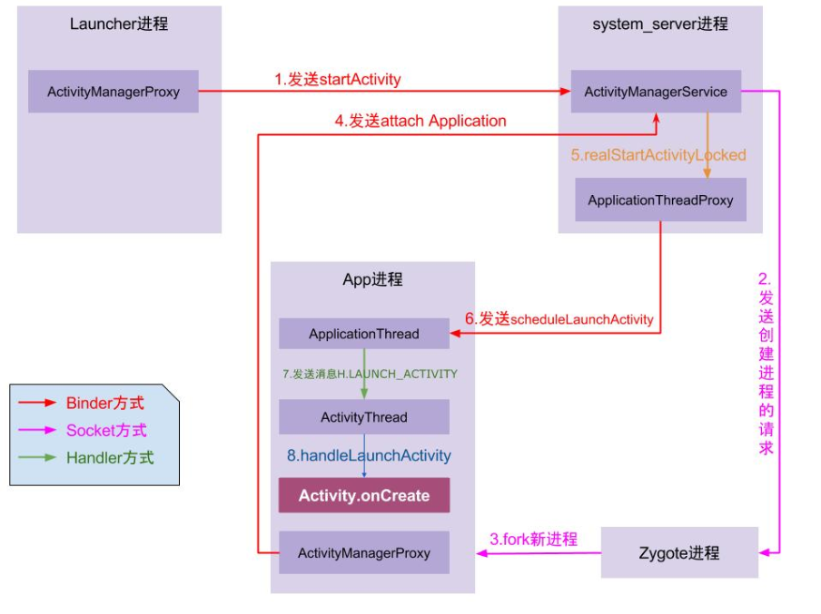
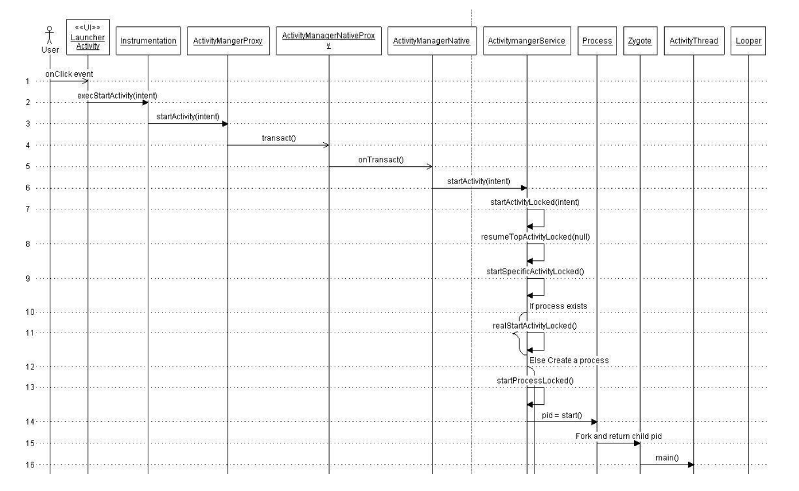
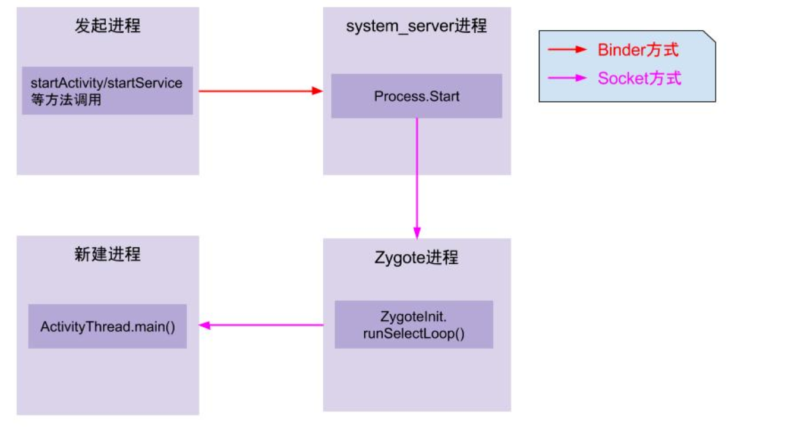
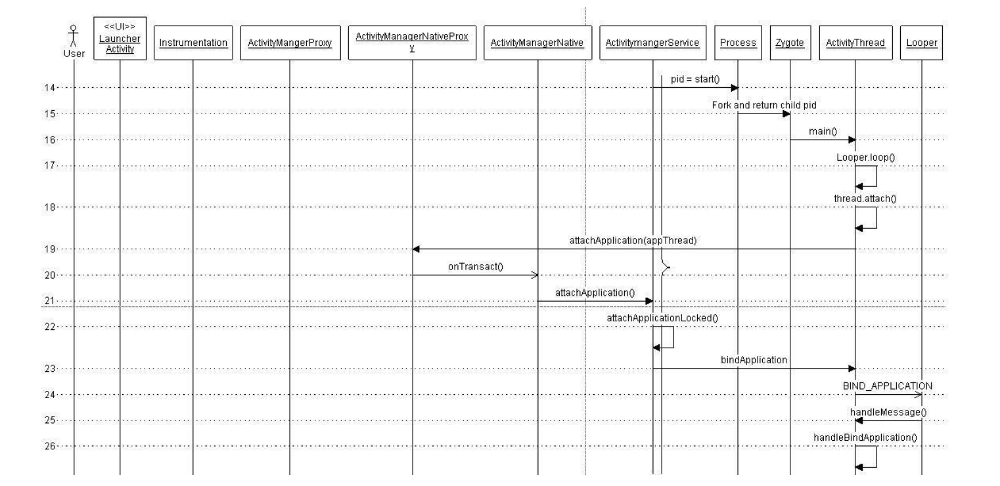
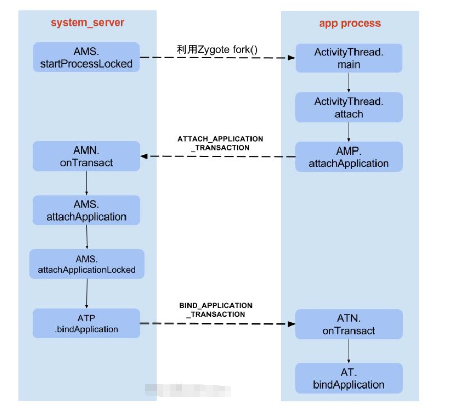
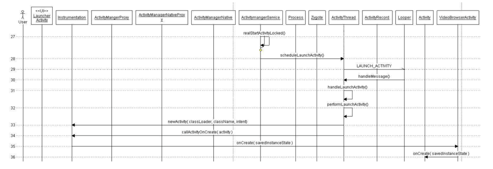
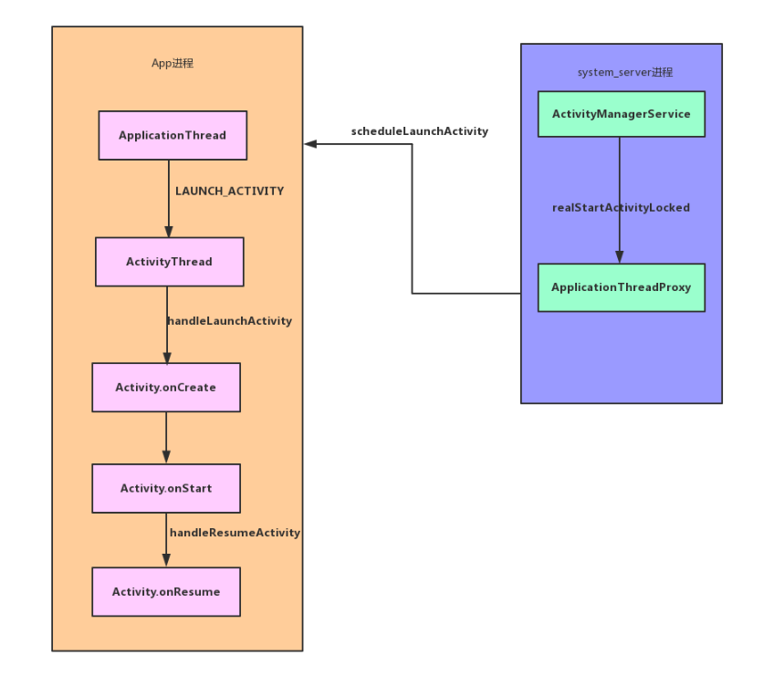
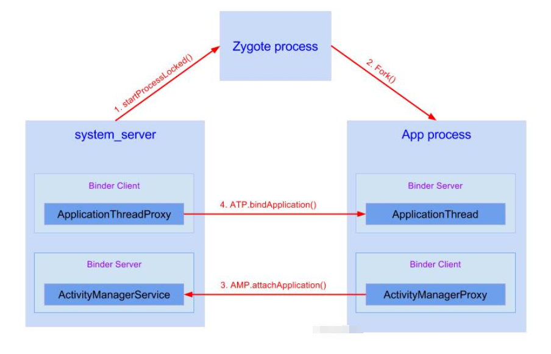

## 一、流程概述



#### 启动流程：

①点击桌面App图标，Launcher进程采用Binder IPC向system_server进程发起startActivity请求；

②system_server进程接收到请求后，向zygote进程发送创建进程的请求；

③Zygote进程fork出新的子进程，即App进程；

④App进程，通过Binder IPC向sytem_server进程发起attachApplication请求；

⑤system_server进程在收到请求后，进行一系列准备工作后，再通过binder IPC向App进程发送scheduleLaunchActivity请求；

⑥App进程的binder线程（ApplicationThread）在收到请求后，通过handler向主线程发送LAUNCH_ACTIVITY消息；

⑦主线程在收到Message后，通过发射机制创建目标Activity，并回调Activity.onCreate()等方法。

⑧到此，App便正式启动，开始进入Activity生命周期，执行完onCreate/onStart/onResume方法，UI渲染结束后便可以看到App的主界面。

上面的一些列步骤简单介绍了一个APP启动到主页面显示的过程，可能这些流程中的一些术语看的有些懵，什么是Launcher，什么是zygote，什么是applicationThread.....

下面我们一一介绍。

## 二、理论基础

### 1.zygote

zygote意为“受精卵“。Android是基于Linux系统的，而在Linux中，所有的进程都是由init进程直接或者是间接fork出来的，zygote进程也不例外。

在Android系统里面，zygote是一个进程的名字。Android是基于Linux System的，当你的手机开机的时候，Linux的内核加载完成之后就会启动一个叫“init“的进程。在Linux System里面，所有的进程都是由init进程fork出来的，我们的zygote进程也不例外。

我们都知道，每一个App其实都是

● 一个单独的dalvik虚拟机

● 一个单独的进程

所以当系统里面的第一个zygote进程运行之后，在这之后再开启App，就相当于开启一个新的进程。而为了实现资源共用和更快的启动速度，Android系统开启新进程的方式，是通过fork第一个zygote进程实现的。所以说，除了第一个zygote进程，其他应用所在的进程都是zygote的子进程，这下你明白为什么这个进程叫“受精卵”了吧？因为就像是一个受精卵一样，它能快速的分裂，并且产生遗传物质一样的细胞！

### 2.system_server

SystemServer也是一个进程，而且是由zygote进程fork出来的。

知道了SystemServer的本质，我们对它就不算太陌生了，这个进程是Android Framework里面两大非常重要的进程之一——另外一个进程就是上面的zygote进程。

为什么说SystemServer非常重要呢？因为系统里面重要的服务都是在这个进程里面开启的，比如
ActivityManagerService、PackageManagerService、WindowManagerService等等。

### 3.ActivityManagerService

ActivityManagerService，简称AMS，服务端对象，负责系统中所有Activity的生命周期。

ActivityManagerService进行初始化的时机很明确，就是在SystemServer进程开启的时候，就会初始化ActivityManagerService。

### 下面介绍下Android系统里面的服务器和客户端的概念。

其实服务器客户端的概念不仅仅存在于Web开发中，在Android的框架设计中，使用的也是这一种模式。服务器端指的就是所有App共用的系统服务，比如我们这里提到的ActivityManagerService，和前面提到的PackageManagerService、WindowManagerService等等，这些基础的系统服务是被所有的App公用的，当某个App想实现某个操作的时候，要告诉这些系统服务，比如你想打开一个App，那么我们知道了包名和MainActivity类名之后就可以打开

```java
Intent intent = new Intent(Intent.ACTION_MAIN);  
intent.addCategory(Intent.CATEGORY_LAUNCHER);              
ComponentName cn = new ComponentName(packageName, className);              
intent.setComponent(cn);  
startActivity(intent);
```

但是，我们的App通过调用startActivity()并不能直接打开另外一个App，这个方法会通过一系列的调用，最后还是告诉AMS说：“我要打开这个App，我知道他的住址和名字，你帮我打开吧！”所以是AMS来通知zygote进程来fork一个新进程，来开启我们的目标App的。这就像是浏览器想要打开一个超链接一样，浏览器把网页地址发送给服务器，然后还是服务器把需要的资源文件发送给客户端的。

知道了Android Framework的客户端服务器架构之后，我们还需要了解一件事情，那就是我们的App和AMS(SystemServer进程)还有zygote进程分属于三个独立的进程，他们之间如何通信呢？

**App与AMS通过Binder进行IPC通信，AMS(SystemServer进程)与zygote通过Socket进行IPC通信。后面具体介绍。**

那么AMS有什么用呢？**在前面我们知道了，如果想打开一个App的话，需要AMS去通知zygote进程，除此之外，其实所有的Activity的开启、暂停、关闭都需要AMS来控制，所以我们说，AMS负责系统中所有Activity的生命周期。**

在Android系统中，**任何一个Activity的启动都是由AMS和应用程序进程（主要是ActivityThread）相互配合来完成的。AMS服务统一调度系统中所有进程的Activity启动，而每个Activity的启动过程则由其所属的进程具体来完成。**

### 4.Launcher

当我们点击手机桌面上的图标的时候，App就由Launcher开始启动了。但是，你有没有思考过Launcher到底是一个什么东西？

**Launcher本质上也是一个应用程序，和我们的App一样，也是继承自Activity**

packages/apps/Launcher2/src/com/android/launcher2/Launcher.java

```java
public final class Launcher extends Activity
        implements View.OnClickListener, OnLongClickListener, LauncherModel.Callbacks,
                   View.OnTouchListener {
                   }
```

Launcher实现了点击、长按等回调接口，来接收用户的输入。既然是普通的App，那么我们的开发经验在这里就仍然适用，比如，我们点击图标的时候，是怎么开启的应用呢？**捕捉图标点击事件，然后startActivity()发送对应的Intent请求呗！是的，Launcher也是这么做的，就是这么easy！**

### 5.Instrumentation和ActivityThread

每个Activity都持有Instrumentation对象的一个引用，但是整个进程只会存在一个Instrumentation对象。
Instrumentation这个类里面的方法大多数和Application和Activity有关，**这个类就是完成对Application和Activity初始化和生命周期的工具类。**Instrumentation这个类很重要，对Activity生命周期方法的调用根本就离不开他，他可以说是一个大管家。

ActivityThread，依赖于UI线程。App和AMS是通过Binder传递信息的，那么ActivityThread就是专门与AMS的外交工作的。

### 6.ApplicationThread

前面我们已经知道了App的启动以及Activity的显示都需要AMS的控制，那么我们便需要和服务端的沟通，而这个沟通是双向的。

**客户端-->服务端**


而且由于继承了同样的公共接口类，ActivityManagerProxy提供了与ActivityManagerService一样的函数原型，使用户感觉不出Server是运行在本地还是远端，从而可以更加方便的调用这些重要的系统服务。

**服务端-->客户端**

还是通过Binder通信，不过是换了另外一对，换成了ApplicationThread和ApplicationThreadProxy。


他们也都实现了相同的接口IApplicationThread

```java
  private class ApplicationThread extends ApplicationThreadNative {}

  public abstract class ApplicationThreadNative extends Binder implements IApplicationThread{}

  class ApplicationThreadProxy implements IApplicationThread {}
```

**好了，前面罗里吧嗦的一大堆，介绍了一堆名词，可能不太清楚，没关系，下面结合流程图介绍。**

## 三、启动流程

### 1.创建进程

①先从Launcher的startActivity()方法，通过Binder通信，调用ActivityManagerService的startActivity方法。

②一系列折腾，最后调用startProcessLocked()方法来创建新的进程。

③该方法会通过前面讲到的socket通道传递参数给Zygote进程。Zygote孵化自身。调用ZygoteInit.main()方法来实例化ActivityThread对象并最终返回新进程的pid。

④调用ActivityThread.main()方法，ActivityThread随后依次调用Looper.prepareLoop()和Looper.loop()来开启消息循环。

**方法调用流程图如下:**



**更直白的流程解释：**



①App发起进程：当从桌面启动应用，则发起进程便是Launcher所在进程；当从某App内启动远程进程，则发送进程便是该App所在进程。发起进程先通过binder发送消息给system_server进程；

②system_server进程：调用Process.start()方法，通过socket向zygote进程发送创建新进程的请求；

③zygote进程：在执行ZygoteInit.main()后便进入runSelectLoop()循环体内，当有客户端连接时便会执行ZygoteConnection.runOnce()方法，再经过层层调用后fork出新的应用进程；

④新进程：执行handleChildProc方法，最后调用ActivityThread.main()方法。

### 2.绑定Application

上面创建进程后，执行ActivityThread.main()方法，随后调用attach()方法。

将进程和指定的Application绑定起来。这个是通过上节的ActivityThread对象中调用bindApplication()方法完成的。该方法发送一个BIND_APPLICATION的消息到消息队列中, 最终通过handleBindApplication()方法处理该消息. 然后调用makeApplication()方法来加载App的classes到内存中。

**方法调用流程图如下：**



**更直白的流程解释：**



（如果看不懂AMS,ATP等名词，后面有解释）

### 3.显示Activity界面

经过前两个步骤之后, 系统已经拥有了该application的进程。 后面的调用顺序就是普通的从一个已经存在的进程中启动一个新进程的activity了。

实际调用方法是realStartActivity(), 它会调用application线程对象中的scheduleLaunchActivity()发送一个LAUNCH_ACTIVITY消息到消息队列中, 通过 handleLaunchActivity()来处理该消息。在 handleLaunchActivity()通过performLaunchActiivty()方法回调Activity的onCreate()方法和onStart()方法，然后通过handleResumeActivity()方法，回调Activity的onResume()方法，最终显示Activity界面。



**更直白的流程解释：**



## 四、Binder通信



##### 简称:

**ATP:** ApplicationThreadProxy

**AT:** ApplicationThread

**AMP:** ActivityManagerProxy

**AMS: **ActivityManagerService

##### 图解:

①system_server进程中调用startProcessLocked方法,该方法最终通过socket方式,将需要创建新进程的消息告知Zygote进程,并阻塞等待Socket返回新创建进程的pid;

②Zygote进程接收到system_server发送过来的消息, 则通过fork的方法，将zygote自身进程复制生成新的进程，并将ActivityThread相关的资源加载到新进程app process,这个进程可能是用于承载activity等组件;

③ 在新进程app process向servicemanager查询system_server进程中binder服务端AMS, 获取相对应的Client端,也就是AMP. 有了这一对binder c/s对, 那么app process便可以通过binder向跨进程system_server发送请求,即attachApplication()

④system_server进程接收到相应binder操作后,经过多次调用,利用ATP向app process发送binder请求, 即bindApplication.
system_server拥有ATP/AMS, 每一个新创建的进程都会有一个相应的AT/AMP,从而可以跨进程 进行相互通信. 这便是进程创建过程的完整生态链。

以上大概介绍了一个APP从启动到主页面显示经历的流程，主要从宏观角度介绍了其过程，具体可结合源码理解。
