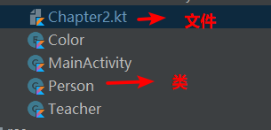
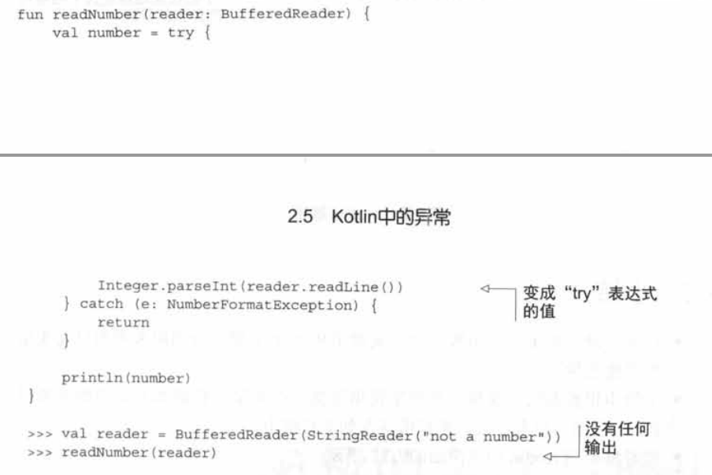

# 第二章：基础

## 2.1 函数与变量

* **函数** 

1. 函数的声明以关键字**fun**开头，函数名其后，括号括起来的是参数列表，参数列表后面跟着返回值类型，中间用冒号隔开；

   ```kotlin
   fun name(参数名 : 参数类型...) : 返回值类型
   ```

2. 函数的函数体可以有两种：（一）花括号；（二）表达式函数体；

   表达书函数体由单个表达式构成，可以用这个表达式作为完整的函数体，去掉花括号与return语句；

   

   注意：

   1. 在Kotlin中绝大多数的控制结构都是表达式，除了for, while循环;
   2. 表达式有值；

* **变量** 

  1. 以关键字**val** or **var**开头

  2. val 不可变引用； var可变引用；
  3. val引用自身是不可变的，但是它指向的对象可能是可变的；
  4. var允许改变变量改变自身的值，但是类型不可改变；

* **字符串模板** 

  1. 允许在字符串字面值中引用局部变量，也可以引用表达式，表达式需要用花括号括起来；
  2. 在双引号中可以嵌套双引号；

  

  

## 2.2类和属性

1. public是默认属性；

2. **只读属性** : val声明, 生成一个字段和一个简单的getter; **可写属性** ：一个字段，一个getter和一个setter；

3. 大多数情况下，属性有一个对应的支持字段来保存属性的值，但是如果该值可以即时计算，那就可以自定义getter来表示；

   

4. Kotlin不区分导入的是类还是函数，允许使用import关键字导入任何种类的声明，可以直接导入顶层函数的名称；***** 用来导入特定包中定义的所有声明，这种星号的导入不仅让包中的定义的类可见，也会让顶层函数和属性可见；

5. 可以使用文件来包含多个类；

   

## 2.3 表示和处理选择：枚举与when

* 枚举

  关键字： **enum** **class** name

  enum不一定是值得列表，也可以给枚举类声明属性和方法

* when

  1. **有返回值的表达式**；

  

  2. **分支条件可以是任何对象**；
  3. **is用来判断一个变量是否是某种类型** ；

## 2.4迭代

1. while循环与Java相同；

2. **区间** ： 符号： **..**  递增（包括结束值）； untile （不包含结束值）

   

3. for循环： **for in** 

   

   **downTo 递减** 

   **step** 设置步长

4. 最常用的场景迭代集合

   

   迭代集合时也可以使用下标: **withIndex**

   

5. 使用**in** or **!in** 可以检查集合和区间的成员

   

6. 区间没有局限，若一个类实现了Comparable接口，并不能列表这个区间所有的对象，但仍可以使用in运算符检查某个对象是否属于这个区间；

## 2.5 异常

1. kotlin中不区分受检异常和未受检异常；

2. try语句可以作为表达式（最后一行为返回值）；

   
