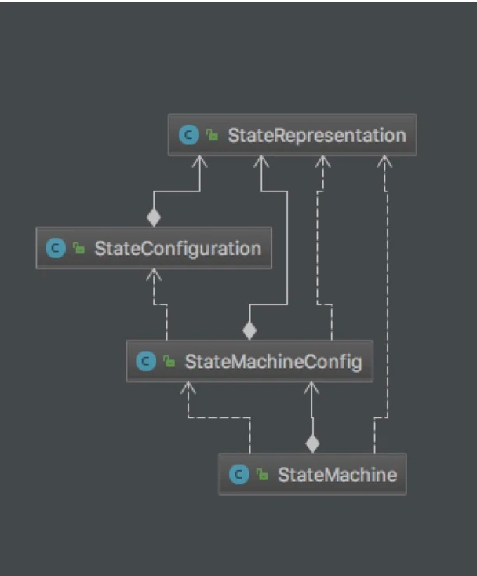

###概念
有限状态机是一种用来进行对象行为建模的工具，其作用主要是描述对象在它的生命周期内所经历的状态序列，以及如何响应来自外界的各种事件。在电商场景（订单、物流、售后）、社交（IM消息投递）、分布式集群管理（分布式计算平台任务编排）等场景都有大规模的使用。

#####状态机的要素
状态机可归纳为4个要素，即现态、条件、动作、次态。“现态”和“条件”是因，“动作”和“次态”是果。详解如下：

    ①现态：是指当前所处的状态。
    ②条件：又称为“事件”。当一个条件被满足，将会触发一个动作，或者执行一次状态的迁移。
    ③动作：条件满足后执行的动作。动作执行完毕后，可以迁移到新的状态，也可以仍旧保持原状态。动作不是必需的，当条件满足后，也可以不执行任何动作，直接迁移到新状态。
    ④次态：条件满足后要迁往的新状态。“次态”是相对于“现态”而言的，“次态”一旦被激活，就转变成新的“现态”了。

#####状态机动作类型

    进入动作（entry action）：在进入状态时进行
    退出动作：在退出状态时进行
    输入动作：依赖于当前状态和输入条件进行
    转移动作：在进行特定转移时进行

#####为什么需要状态机

有限状态机是一种对象行为建模工具，适用对象有一个明确并且复杂的生命流（一般而言三个以上状态），并且在状态变迁存在不同的触发条件以及处理行为。从我个人的使用经验上，使用状态机来管理对象生命流的好处更多体现在代码的可维护性、可测试性上，明确的状态条件、原子的响应动作、事件驱动迁移目标状态，对于流程复杂易变的业务场景能大大减轻维护和测试的难度。

#####技术选型

有限状态机的使用场景很丰富，但在技术选型的时候我主要调研了squirrel-foundation(503stars)，spring-statemachine(305stars)，stateless4j(293stars)，这三款finite state machine是github上stars top3的java状态机引擎框架，下面我的一些对比结果。

#####stateless4j

stateless4j是这三款状态机框架中最轻量简单的实现，来源自stateless(C#版本的FSM)

    StateRepresentation状态表示层，状态对应，注册了每状态的entry exit action，以及该状态所接受的triggerBehaviours；
    StateConfiguration状态节点的配置实例，通过StateMachineConfig.configure创建，由stateRepresentation组成；
    StateMachineConfig状态机配置，负责了全局状态机的创建以及保存，维护了了state到对应StateRepresentation的映射，通过当前状态找到对应的stateRepresentation，再根据triggerBehaviours执行相应的entry exit action；
    StateMachine状态机实例，不可共享，记录了状态机实例的当前状态，并通过statemachine实例来响应事件；

####优缺点
####优点

    足够轻量，创建StateMachine实例开销小；
    支持基本的事件迁移、exit/entry action、guard、dynamic permit(相同的事件不同的condition可到达不同的目标状态)；
    核心代码千行左右，基于现有代码二次开发的难度也比较低；
####缺点

    支持的动作只包含了entry exit action，不支持transition action；
    在状态迁移的模型中缺少全局的observer(缺少interceptor扩展点)，例如要做state的持久化就很恶心(扩展stateMutator在设置目标状态的同时完成持久化的方案将先于entry进行persist实际上并不是一个好的解决方案)；
    状态迁移的模型过于简单，这也导致了本身支持的action和提供的扩展点有限；
####结论

    stateless4j足够轻量，同步模型，在app中使用比较合适，但在服务端解决复杂业务场景上stateless4j确实略显单薄。